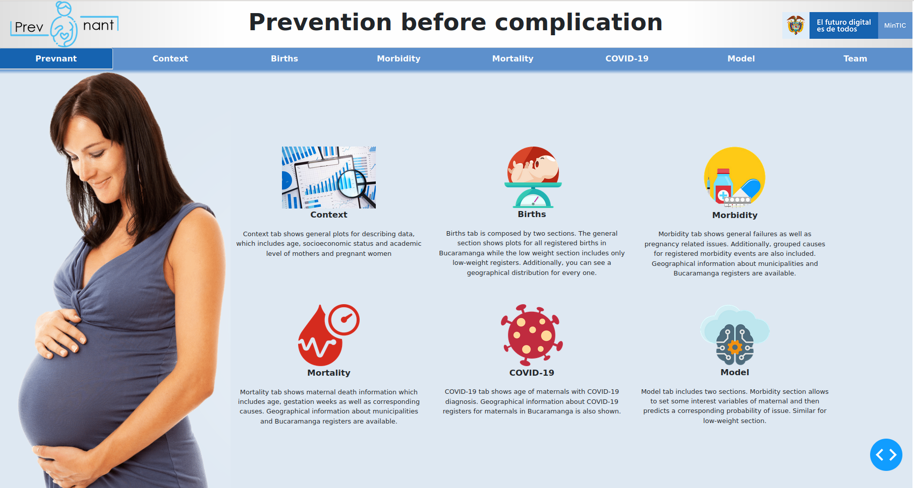
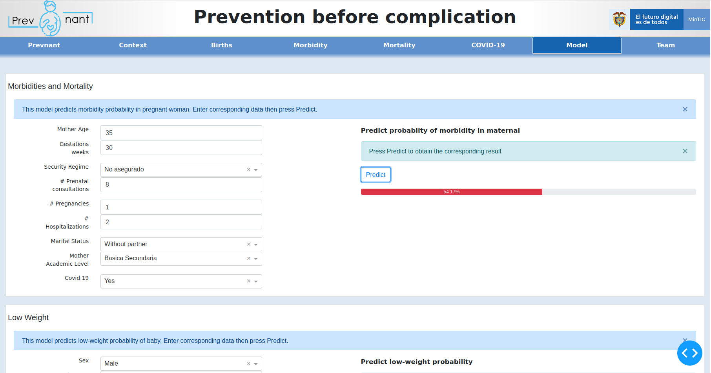

<!-- PROJECT LOGO -->
<!-- 
https://github.com/othneildrew/Best-README-Template/blob/master/README.md#about-the-project
-->
<p align="center">
  
  <h1 align="center">Prevnant</h1>
  <p align="center">Prevention before complication</p>
</p>


<details open="open">
  <summary>Table of Contents</summary>
  <ol>
    <li>
      <a href="#about-the-project">About The Project</a>
      <ul>
        <li><a href="#built-with">Built With</a></li>
      </ul>
    </li>
    <li>
      <a href="#getting-started">Getting Started</a>
      <ul>
        <li><a href="#prerequisites">Prerequisites</a></li>
        <li><a href="#installation">Installation</a></li>
      </ul>
    </li>
    <li><a href="#usage">Usage</a></li>
    <li><a href="#contact">Contact</a></li>
  </ol>
</details>


## About The Project

Prevnant is a tool for generating early warnings in pregnant women about both pregnancy morbidities as well as low weight cases in newborn. It has been developed within DS4A course by [Correlation One](https://www.correlation-one.com/), and data was provided by [Alcaldia de Bucaramanga](https://www.bucaramanga.gov.co/) with corresponding data registers for this municipality.


### Built With

This project was built with:
* [Docker](https://www.docker.com/) an open platform for developing, shipping, and running applications.
* [Dash](https://dash.plotly.com/) a python framework for building web applications and plotting.
* [Flask](https://flask.palletsprojects.com/en/2.0.x/) a python micro web framework for deploying the trained models.
* [SQLAlchemy](https://pypi.org/project/SQLAlchemy/)  a python SQL toolkit for database access.

Additionally, the trained models use [Scikit-learn](https://scikit-learn.org/stable/)


## Getting Started

The following instructions will allow you to get a copy of the project running on your local machine for development and testing purposes.


### Prerequisites

This project uses Docker, such that you only need to install it.
* Follow Docker install instructions [here](https://docs.docker.com/engine/install/ubuntu/).


### Installation

1. Clone the repo
   ```sh
   git clone https://github.com/DS4-Team-55/front-end.git
   ```
2. Run the start script. It may take some minutes while all dependencies are installed.
   ```sh
   ./start
   ```
3. Change the working directory
   ```sh
   cd /home/project/
   ```
4. Run dashboard script
   ```sh
   python dashboard.py
   ```
5. Run models API
   ```sh
   python api_server.py
   ```
**It is recommended to use screen for every script**


## Usage

Once the dashboard and models api are runnning, you can access the app through your browser. Use `<ip-address>:8050`.

The following interface is shown.



You can explore the data through every tab in the app. Additionally, in `Model` tab you can set the corresponding values and get a prediction value for morbidity and/or low weight, from the trained models.




## Contact

* Melissa Garcia Herrera - [Contact](https://www.linkedin.com/in/melissa-garcia-8b160569/)
* Andrea Jimenez - [Contact](https://co.linkedin.com/in/andreajimenezguevara)
* Diana Castellanos - [Contact](https://www.linkedin.com/in/diana-castellanos-a692b0123/)
* David Castrillon - [Contact](https://www.linkedin.com/in/david-castrillon-95b28712b/)
* David Angarita - [Contact](https://www.linkedin.com/in/david-angarita-275700190)
* Ever Augusto Torres - [Contact](https://www.linkedin.com/in/evertorres/)
* Julio Cesar Garcia - [Contact](https://twitter.com/your_username)
